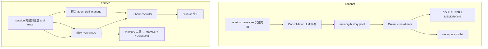

# Dream 技能发现 vs Hermes 自学习技能

本文对比 nanobot 的 **Dream 技能发现** 与 [Hermes Agent](https://github.com/NousResearch/hermes-agent) 的 **自学习技能生成**（`skill_manage` + background self-improvement loop）。

两者文档描述相似——「把重复工作流提升为可复用 skill」——但实现哲学、输入来源、触发时机与运维体系差异很大。

## 一句话总结

| 项目 | 本质 |
|------|------|
| **nanobot Dream** | 离线、跨会话、从 **有损摘要** 里推断，主 agent 不参与 skill 创建 |
| **Hermes 自学习** | 在线、从 **完整对话 transcript** 里主动提炼，skill 是一等公民工具 |

---

## 架构对比



---

## nanobot Dream：技能发现如何工作

### 数据流

1. **Consolidator**（token 压力触发）：把 `session.messages` 里最老一段交给 LLM，用 `consolidator_archive.md` 压成带标签的要点，写入 `memory/history.jsonl`。
2. **Dream**（默认每 2 小时 cron，或 `/dream`）：只读 `.dream_cursor` 之后的 jsonl 行，整理进长期记忆，必要时新建 skill。

实现入口：

- `nanobot/agent/memory.py` → `MemoryStore.build_dream_prompt()`、`build_dream_tools()`
- `nanobot/templates/agent/dream.md` → 技能发现规则
- `nanobot/templates/agent/consolidator_archive.md` → Consolidator 摘要提示词

### `history.jsonl` 里是什么？

不是原始对话 dump，而是 **Consolidator 产出的 SNIP 要点**。每行形如：

```json
{"cursor": 42, "timestamp": "2026-06-09 14:30", "content": "- [durable] 部署用 deploy.sh --env prod\n- [permanent] 用户偏好中文回复"}
```

Consolidator 输入侧会把消息格式化成「角色 + 用过的工具 + 内容」：

```python
# nanobot/agent/memory.py — MemoryStore._format_messages()
f"[{timestamp}] {role.upper()}{tools}: {content}"
```

但 Dream 阶段看到的已是二次压缩：

| 限制 | 值 |
|------|-----|
| Consolidator 单条摘要上限 | ~8,000 字符 |
| Dream prompt 每条条目 | 截断到 **500 字符** |
| Dream 每批处理条数 | 默认 **20 条** |
| LLM 失败时 raw dump | ~16,000 字符（仍是有损片段） |

### Dream 实际读什么、写什么？

`build_dream_prompt()` 组装：

```
dream.md 系统指令 + "## Conversation History" + 一批 jsonl 摘要
```

**不会**把 SOUL / USER / MEMORY 全文嵌入 prompt（省 token）；Dream 运行时用 `read_file` 自己读。

工具权限（`build_dream_tools()`）：

| 工具 | 可写范围 |
|------|----------|
| `read_file` | 整个 workspace + 内置 `skill-creator` |
| `edit_file` / `apply_patch` | `SOUL.md`、`USER.md`、`memory/MEMORY.md` |
| `write_file` | **仅** `workspace/skills/` |

Dream 完成后：

- 成功 → 推进 `.dream_cursor`
- 有变更 → `GitStore.auto_commit()`（仅跟踪 SOUL / USER / MEMORY / `.dream_cursor`，**不含 skills/**）

### 技能发现规则（`dream.md`）

**没有**独立的模式检测器（无计数器、embedding 聚类、规则引擎）。规则写在 prompt 里，由 LLM 判断：

```markdown
## Skill discovery & creation
Flag [SKILL] only when ALL are true:
- repeatable workflow appeared 2+ times
- involves clear steps (not vague preferences)
- substantial enough for its own instruction set
```

「出现 2+ 次」= LLM 在**多条 history 摘要**里看到相似工作流，不是程序统计。

创建 skill 时：

1. `read_file` 读现有 `skills/`、`skill-creator/SKILL.md`（格式参考）
2. 读 `MEMORY.md` 等，把 operational details 迁出
3. `write_file` 写到 `workspace/skills/<name>/SKILL.md`

### 完整工作流从哪来？

**不是**从原始 transcript 精确提取，而是 **LLM 从有损摘要里重构**：

| 信息来源 | 能保留什么 |
|---------|-----------|
| Consolidator 摘要 | 用户偏好、决策、验证过的解法、命令/步骤（若摘要时写进去了） |
| 多条 jsonl 跨 session | 「这个流程又做了一遍」的重复信号 |
| `MEMORY.md` | 可能暂存的操作细节（Dream 会按 MECE 规则迁到 Skill） |
| `skill-creator` 模板 | Skill 结构与写法 |
| LLM 补全 | 根据上下文推断缺失步骤（可能不完整或泛化） |

### 主 agent 能否创建 skill？

**不能。** nanobot 主 agent 没有 `skill_manage` 类工具；skill 写入基本只在 Dream 里发生。用户可手动在 `workspace/skills/` 下创建，或通过 ClawHub 等安装。

---

## Hermes 自学习：技能生成如何工作

### 核心组件

| 组件 | 作用 |
|------|------|
| `skill_manage` 工具 | 程序性记忆：create / patch / edit / delete / write_file |
| Background review fork | 回合结束后后台 fork，读完整对话 snapshot，决定是否更新 memory / skill |
| `memory` 工具 | 声明式记忆：写入 `MEMORY.md` / `USER.md`（有字符上限） |
| Curator | 后台维护：usage 追踪、stale 归档、LLM 合并重复 skill |

实现入口：

- `tools/skill_manager_tool.py` → `skill_manage`
- `agent/background_review.py` → `_SKILL_REVIEW_PROMPT`、review fork
- `tools/skill_usage.py` → `.usage.json` 遥测
- Curator → `hermes curator` CLI

### 触发时机

**后台 self-improvement fork**（`run_agent.py` → `_spawn_background_review`）：

| 条件 | 动作 |
|------|------|
| 每 **10** 轮 user prompt | review memory |
| 单轮内每 **10** 次 tool iteration | review skills |

fork 拿的是 **`messages_snapshot`**——含 user / assistant / tool 的完整轨迹，不是摘要。

**前台 agent**：

- 任务中可直接调 `skill_manage`
- 复杂任务完成后可提议「要不要存成 skill」
- 用户明确要求时创建（`skill_manage` schema 写明需确认）

**Curator**（默认 7 天 + idle 2h）：

1. 确定性状态转换：`active → stale → archived`
2. LLM 审查 pass：合并重叠 skill、patch 漂移内容

### 技能创建标准

同样**没有**代码级 pattern matching，但判定标准更宽松、更积极：

| 信号 | 是否触发 skill 更新 |
|------|-------------------|
| 复杂任务成功（5+ tool calls） | ✅ |
| 踩坑后找到可行路径 | ✅ |
| 用户纠正风格/流程 | ✅（first-class skill signal） |
| 已加载 skill 过时/缺步骤 | ✅ 立即 patch |
| 单次会话、无纠错、无新技巧 | 可跳过 |

`_SKILL_REVIEW_PROMPT` 明确写：**「pass 什么都不做是 missed opportunity，不是中性结果」**。

更新优先级：

1. Patch **当前会话已加载** 的 skill
2. Patch 已有 umbrella skill（`skills_list` + `skill_view`）
3. 在 umbrella 下加 `references/` / `templates/` / `scripts/`
4. 创建新的 class-level umbrella skill

### 记忆与 skill 的分工

Hermes 刻意拆分：

| 类型 | 工具 | 存储 | 内容 |
|------|------|------|------|
| 声明式记忆 | `memory` | `MEMORY.md` / `USER.md` | 用户是谁、环境事实、偏好（~2200 / ~1375 字符上限） |
| 程序性记忆 | `skill_manage` | `~/.hermes/skills/` | 怎么做某类任务：步骤、命令、pitfalls |

用户抱怨「你怎么老这么干」→ 应写进 **skill**（how to do），而不只是 memory（who they are）。

### Skill 生命周期

Hermes 有完整运维体系，nanobot 没有等价物：

| 能力 | Hermes | nanobot |
|------|--------|---------|
| Usage 遥测 | `.usage.json`（view/patch/use_count） | ❌ |
| 自动归档 | Curator → `.archive/` | ❌ |
| 去重合并 | Curator LLM pass | ❌（仅 prompt 要求检查重复） |
| Pin 保护 | `hermes curator pin` | ❌ |
| 来源标记 | bundled / hub / agent-created / user-directed | ❌ |
| 安全扫描 | `skills.guard_agent_created`（可选） | ❌ |
| Git 版本管理 | Curator backup / rollback | Dream GitStore（不含 skills/） |
| 支持文件 | references / templates / scripts / assets | 仅 SKILL.md（Dream write_file） |

---

## 维度对比表

| 维度 | nanobot Dream | Hermes 自学习 |
|------|---------------|---------------|
| **架构** | 离线批处理（cron + jsonl 队列） | 在线 + 后台 fork + 前台工具 |
| **输入** | `history.jsonl` 摘要（有损，每行 500 字符） | 完整 `messages_snapshot`（含 tool trace） |
| **触发** | 每 2h / `/dream` | 每 10 轮或每 10 tool iter + 对话中随时 |
| **重复检测** | LLM 判断摘要中「2+ 次」 | 单次会话即可；跨会话靠 skill 库 + `session_search` |
| **创建者** | 仅 Dream agent | 前台 agent + 后台 fork + Curator |
| **记忆整合** | Dream 一次管 SOUL/USER/MEMORY/skills | memory 与 skill_manage 分离 |
| **Skill 质量** | 依赖 Consolidator 摘要保真度 | 依赖当轮 transcript 完整性 |
| **运维** | GitStore（memory 文件）+ jsonl compact | Curator + usage + archive + backup |
| **用户感知** | 无感后台整理 | 回合后可见「💾 skill updated」类摘要 |

---

## 适用场景

| 场景 | 更合适 |
|------|--------|
| 同一工作流跨很多 session 反复出现 | nanobot Dream（若 Consolidator 摘要写得好） |
| 刚完成复杂任务，立刻固化步骤 | Hermes |
| 用户当场纠错「别这么格式化」 | Hermes |
| 低干扰、批量整理长期记忆 | nanobot Dream |
| skill 库膨胀、需要去重归档 | Hermes Curator |
| 极简部署、少 moving parts | nanobot |

---

## 文档与实现注意事项

### nanobot 内部文档过时点

`docs/nanobot-vs-openclaw-zh/memory.md` 仍描述 Dream 的 **Phase 1 分析 + Phase 2 落盘** 两阶段（`dream_phase1.md` / `dream_phase2.md`）。当前代码已合并为 **单轮 `dream.md` + AgentRunner 工具调用**；`dream_phase*.md` 模板文件已不存在。

核心逻辑（jsonl 摘要 → Dream 推断 → 写 `skills/`）与文档意图一致，但实现形态已简化。

### 提升 nanobot Dream skill 质量的方向

若 Consolidator 摘要没记下具体命令/步骤，生成的 Skill 往往会偏泛或缺细节。可行改进方向（本文档仅分析，非路线图承诺）：

1. Consolidator prompt 加强对「可复用工作流步骤」的保留
2. Dream 放宽单条 500 字符截断，或按 `[durable]` 标签优先保留
3. 给主 agent 增加受限版 `skill_manage`（会话内即时学习）
4. 为 `skills/` 纳入 GitStore 或独立版本管理
5. 增加 skill 去重/归档机制（类似 Curator 轻量版）

---

## 代码索引

### nanobot

| 文件 | 内容 |
|------|------|
| `nanobot/agent/memory.py` | `MemoryStore`、`Consolidator`、`build_dream_prompt()`、`build_dream_tools()` |
| `nanobot/templates/agent/dream.md` | Dream 路由规则、技能发现条件 |
| `nanobot/templates/agent/consolidator_archive.md` | Consolidator 摘要提示词 |
| `nanobot/cli/commands.py` | Dream cron job |
| `nanobot/command/builtin.py` | `/dream` 命令 |
| `docs/memory.md` | nanobot 记忆系统总览（未涵盖 skill 细节） |

### Hermes Agent

| 文件 | 内容 |
|------|------|
| `tools/skill_manager_tool.py` | `skill_manage` 工具 |
| `agent/background_review.py` | 后台 review fork 与 `_SKILL_REVIEW_PROMPT` |
| `tools/skill_usage.py` | Curator 遥测 sidecar |
| `run_agent.py` | `_spawn_background_review()` |
| `website/docs/user-guide/features/skills.md` | Skills 系统与 agent-managed skills |
| `website/docs/user-guide/features/curator.md` | Curator 维护机制 |

---

## 相关文档

- [Memory in nanobot](./memory.md) — Consolidator + Dream 记忆流程
- [记忆系统（nanobot vs OpenClaw）](./nanobot-vs-openclaw-zh/memory.md) — 含 Dream 与 OpenClaw Dreaming 对比（部分 Phase 描述待更新）
