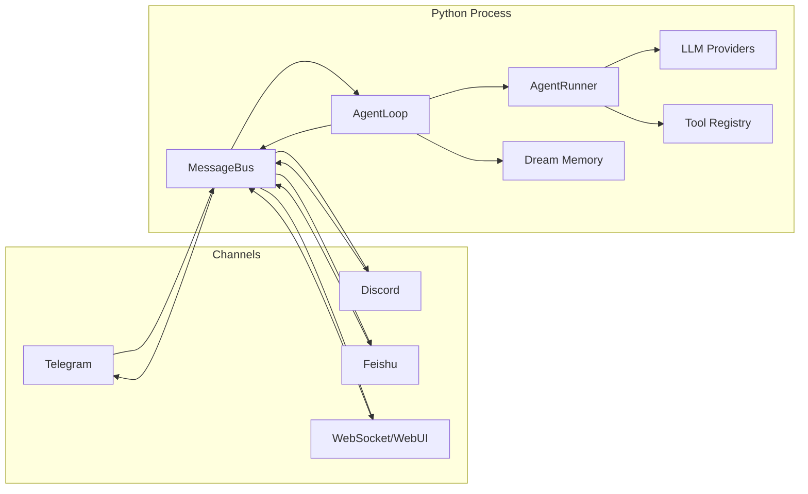
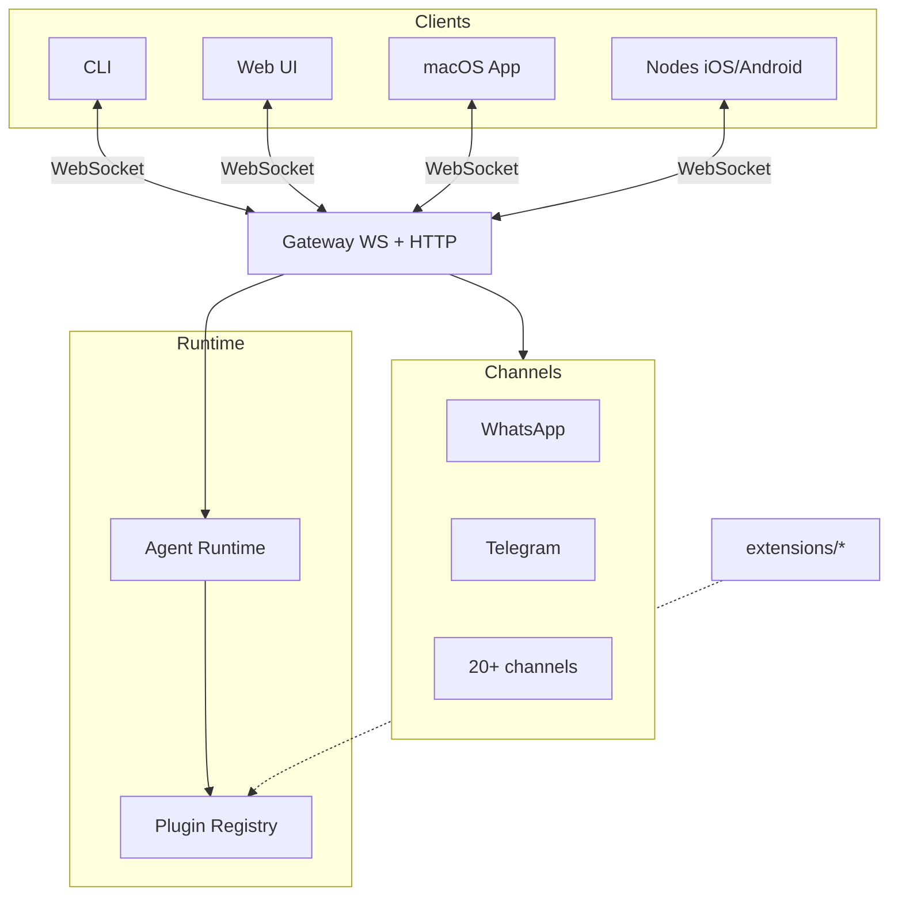

# 架构示意图

[← 目录](./README.md)

## nanobot（进程内总线）

```mermaid
flowchart LR
  subgraph Channels
    TG[Telegram]
    DC[Discord]
    FS[Feishu]
    WS[WebSocket/WebUI]
  end

  subgraph Core["Python Process"]
    BUS[MessageBus]
    LOOP[AgentLoop]
    RUN[AgentRunner]
    PROV[LLM Providers]
    TOOLS[Tool Registry]
    MEM[Dream Memory]
    LOOP --> RUN
    RUN --> PROV
    RUN --> TOOLS
    LOOP --> MEM
  end

  TG & DC & FS & WS --> BUS
  BUS --> LOOP
  LOOP --> BUS
  BUS --> TG & DC & FS & WS
```

## OpenClaw（Gateway 控制平面）

```mermaid
flowchart TB
  subgraph Clients
    CLI[CLI]
    WEB[Web UI]
    MAC[macOS App]
    NODE[Nodes iOS/Android]
  end

  GW[Gateway WS + HTTP]
  
  subgraph Channels
    WA[WhatsApp]
    TG[Telegram]
    MORE[20+ channels]
  end

  subgraph Runtime
    AG[Agent Runtime]
    PLG[Plugin Registry]
    AG --> PLG
  end

  CLI & WEB & MAC & NODE <-->|WebSocket| GW
  GW --> Channels
  GW --> AG
  EXT[extensions/*] -.-> PLG
```

**下一步**：[代码哲学](./philosophy.md)
