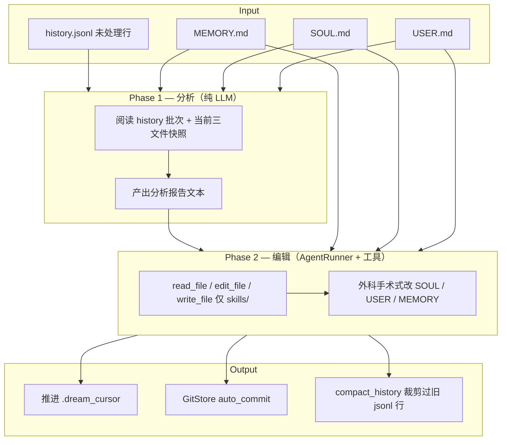

# 记忆系统（深度对比）

[← 目录](./README.md)

两者都强调「记忆写在磁盘 Markdown 里」，但**分层、每日笔记、检索方式**差异很大。

## 记忆分层总览

| 层级 | nanobot | OpenClaw |
|------|---------|----------|
| **当前对话** | `Session.messages`（按 session 键持久化 JSON） | 会话 transcript + 上下文引擎 |
| **压缩归档** | `memory/history.jsonl`（Consolidator 写的摘要行） | 会话压缩 + 短期 recall 状态（`memory/.dreams/` 等） |
| **长期事实** | `memory/MEMORY.md` | `MEMORY.md` |
| **人格/用户** | `SOUL.md`、`USER.md`（Dream 可改） | 同上 + 可选 `DREAMS.md` 日记 |
| **每日笔记** | ❌ **无** `YYYY-MM-DD.md` | ✅ `memory/YYYY-MM-DD.md`（运行观察） |
| **新会话预热** | 注入 `history.jsonl` 中 Dream 未处理片段 + `MEMORY.md` | 默认加载今/昨每日笔记；`/new` 可预加载最近 N 天 |
| **语义检索** | ❌ 内置无向量/SQLite 索引 | ✅ `memory_search` / `memory_get`（默认 SQLite FTS5 + embedding 混合） |
| **后台整理** | ✅ **Dream**（两阶段 LLM） | ✅ **Dreaming**（Light / Deep / REM，默认关闭需开启） |

## OpenClaw 的「每日记忆」— nanobot 没有等价物

OpenClaw 工作区典型结构：

```text
workspace/
├── MEMORY.md                 # 长期记忆
├── memory/
│   ├── 2026-05-26.md         # 当日笔记（agent 可随时写）
│   ├── 2026-05-25.md         # 昨日
│   └── ...
└── DREAMS.md                 # 可选：Dream 日记（给人看）
```

- **每日文件**由 agent 在对话中追加观察；新会话或 `/new` 时可按 `dailyMemoryDays`（默认 2）自动加载最近几天内容。
- 平常对话里，每日文件**不**整份塞进上下文，主要靠 **`memory_search` / `memory_get`** 按需读取。

**nanobot 没有 `memory/YYYY-MM-DD.md` 机制。** 跨会话、跨天的「发生了什么」主要落在：

1. **`history.jsonl`** — Consolidator 把旧对话压成摘要行；
2. **`MEMORY.md` / `SOUL.md` / `USER.md`** — Dream 定期提炼后的长期知识。

若需要「今天发生了什么」的日记式记录，需 agent 主动写入 `MEMORY.md`，或依赖 `history.jsonl` 里的时间戳摘要。

## `history.jsonl` 是什么？≠ 当前会话全文

**不是**当前 session 的完整聊天记录。

| 存储 | 内容 | 生命周期 |
|------|------|----------|
| `Session.messages` | 当前会话原始多轮消息（user/assistant/tool） | 按 `session_key` 存盘；过长时 Consolidator **驱逐**旧消息 |
| `memory/history.jsonl` | **全工作区共享**的 append-only 摘要档案 | 每行 JSON：`cursor`、`timestamp`、`content`；跨 session、跨 channel 累积 |

**写入时机：** 当上下文接近 token 上限，`Consolidator` 用 LLM 把 `session.messages` 里尚未 consolidate 的最老一段**总结成一条**，`append_history()` 追加到 `history.jsonl`，并推进 `session.last_consolidated`（内存里旧消息可不再参与 prompt）。

**读入时机：**

- **Dream**：只处理 `cursor > .dream_cursor` 的行；
- **系统提示**：注入 Dream **尚未消化**的最近若干条（`# Recent History`），上限约 50 条 / 32k 字符。

因此：`history.jsonl` = **「已从各会话挤出、等待 Dream 提炼」的全局摘要队列**，不是单一会话的 transcript dump。

## 记忆怎么搜？不只「文件搜索」

| 方式 | nanobot | OpenClaw |
|------|---------|----------|
| 内置语义搜索 | ❌ | ✅ `memory_search`（向量 + 关键词混合，索引 `MEMORY.md` 与 `memory/*.md`） |
| 按文件读取 | ✅ `read_file` / `grep` | ✅ `memory_get` |
| `history.jsonl` | ✅ 内置 **`grep` 工具**（Skill 推荐 `path="memory/history.jsonl"`） | 纳入 memory 索引后可语义搜 |
| 工作区其它文件 | ✅ `grep` / `read_file` | ✅ 工具 + 可选 QMD 等插件索引外部目录 |

nanobot 的 memory Skill（`always: true`）明确：`history.jsonl` **默认不整份加载进上下文**，查历史用 `grep` 分页检索；**没有** OpenClaw 级别的 embedding 记忆库。

## GitStore：长期记忆文件的版本管理

nanobot 在工作区用 **dulwich**（纯 Python Git）为 Dream 改动的文件做**局部 Git 仓库**。

**跟踪文件（默认）：**

- `SOUL.md`
- `USER.md`
- `memory/MEMORY.md`
- `memory/.dream_cursor`

**机制：**

1. `onboard` 时 `GitStore.init()`：写 `.gitignore`（只跟踪上述文件，其余忽略）、空文件占位、初始 commit。
2. 每次 **Dream 成功完成 Phase 2** 且有工具变更 → `auto_commit("dream: <时间>, N change(s)\n\n<Phase1 分析>")`。
3. `line_ages()`：对 `MEMORY.md` 做 git blame，超过 14 天的行在 Dream Phase 1 提示里标 `← Nd`，提示模型考虑更新陈旧事实。
4. 用户命令：
   - `/dream-log` — 查看 commit 列表或某次 diff；
   - `/dream-restore <sha>` — `revert()` 回到该 commit **之前** 的文件状态（含回滚 `.dream_cursor`）。

**目的：** 自动记忆可审计、可回滚，避免 Dream 静默改坏 `SOUL.md` / `MEMORY.md` 后无法恢复。

OpenClaw 长期文件也可由用户自行 Git 管理，但**内置 Dreaming 流程不依赖**与 nanobot 相同的 workspace GitStore 模型；另有 `DREAMS.md` 等人读日记与 `memory/.dreams/` 机器状态目录。

## Dream（nanobot）工作机制

**Dream** = 定时（默认每 2 小时，`agents.defaults.dream.intervalH`）或手动 `/dream` 触发的**两阶段记忆整理器**。它不读完整聊天记录，只处理 **`history.jsonl` 里游标 `.dream_cursor` 之后**的摘要行（这些行通常由 **Consolidator** 用 `consolidator_archive.md` 从旧对话压成要点：用户事实、决策、有效解法、事件等）。



| 阶段 | 做什么 | 不写什么 |
|------|--------|----------|
| **Phase 1** | 读一批 `history.jsonl`（`maxBatchSize` 默认 20），对照当前三文件，输出「该记什么、该删什么」分析 | 不改磁盘 |
| **Phase 2** | 独立 `AgentRunner`，用 `edit_file` 等**增量修改** `SOUL.md`、`USER.md`、`MEMORY.md`；可向 `skills/` 写新 Skill | 只有 Phase 2 **成功完成**才推进 `.dream_cursor` |
| **收尾** | `compact_history()` 压缩 jsonl；有变更则 Git commit | 失败则 cursor 不动，下轮重试 |

### Phase 1：分析清单（`dream_phase1.md`）

一次纯 LLM 调用，同时做 **抽新事实** 与 **扫现有文件去重**。输出每行一种标记：

| 标记 | 含义 |
|------|------|
| `[USER]` / `[SOUL]` / `[MEMORY]` | 写入对应文件的**原子事实**（一句一事） |
| `[USER-REMOVE]` 等 | 删除重复、过时或应合并走的内容 |
| `[SKILL]` | 对话中重复 2+ 次的可复用工作流 → 后续 Phase 2 可建 `skills/<name>/SKILL.md` |
| `[SKIP]` | 本轮无需改动 |

规则要点：MEMORY 不重复 USER/SOUL 已有内容；`MEMORY.md` 可对超过 14 天的行标 `← Nd` 供审查（`annotateLineAges`）；不写天气、临时状态、寒暄。分析失败则**不推进游标**，下轮重试同一批。

### Phase 2：外科手术式落盘（`dream_phase2.md`）

把 Phase 1 报告 + 三文件快照 + 已有 Skill 列表交给带工具的 `AgentRunner`：

- **禁止整文件重写**，只用 `edit_file` 精确匹配 `old_text`；
- 按 `[FILE]` 添加、`[FILE-REMOVE]` 删除；
- `[SKILL]` 先去重再 `write_file` 到 `skills/`；
- 无改动则不调工具。

### 写入「三个桶」

| 文件 | 典型内容 |
|------|----------|
| `USER.md` | 用户身份、习惯、偏好、纠正 |
| `SOUL.md` | 语气、行为原则、沟通风格 |
| `memory/MEMORY.md` | 项目事实、决策、durable 知识（不重复前两者的永久信息） |

实现入口：`nanobot/agent/memory.py` → `Dream.run()`；提示词：`nanobot/templates/agent/dream_phase1.md`、`dream_phase2.md`。

与 **Consolidator** 的分工：

- **Consolidator**：会话内、token 压力驱动，**快**，把旧消息 → `history.jsonl` 一行摘要；
- **Dream**：工作区级、cron 驱动，**慢**，把多行摘要 → 提炼进三个长期 Markdown。

**配置示例**（`~/.nanobot/config.json`）：

```json
{
  "agents": {
    "defaults": {
      "dream": {
        "intervalH": 2,
        "modelOverride": null,
        "maxBatchSize": 20,
        "maxIterations": 15,
        "annotateLineAges": true
      }
    }
  }
}
```

## OpenClaw Dreaming 与 nanobot Dream 的差异

| | nanobot Dream | OpenClaw Dreaming |
|---|---------------|-------------------|
| 默认 | 开启（cron 每 2h） | **默认关闭**，需配置开启 |
| 输入 | mainly `history.jsonl` | 每日记忆、短期 recall、可 redacted 会话 transcript |
| 阶段 | Phase1 分析 + Phase2 工具编辑 | Light（整理）/ Deep（晋升 MEMORY）/ REM（主题反思） |
| 写入 | `SOUL.md`、`USER.md`、`MEMORY.md` | Deep 阶段写 `MEMORY.md`；Light/REM 不写长期文件 |
| 人读输出 | Git commit message + `/dream-log` | `DREAMS.md` 日记、可选 `memory/dreaming/<phase>/YYYY-MM-DD.md` |
| 每日笔记 | 不使用 | Light 阶段消费 `memory/YYYY-MM-DD.md` |

名称相近，但 OpenClaw Dreaming 是 **memory-core 插件**里更复杂、可配置、默认关着的推广管线；nanobot Dream 是**内置、较直接**的「jsonl 摘要 → 三文件」编辑器。

## 记忆相关命令速查（nanobot）

| 命令 | 作用 |
|------|------|
| `/dream` | 立即跑一次 Dream |
| `/dream-log` | 查看 Git 提交历史或某次 diff |
| `/dream-restore` | 列出可回滚版本 |
| `/dream-restore <sha>` | 回滚到指定 commit 之前的状态 |

更细的 nanobot 记忆说明见 [`../memory.md`](../memory.md)。

## 常见问题（nanobot 行为）

### 上下文超限时会主动压缩或重置吗？

**会压缩，重置需你发命令。**

| 机制 | 触发 | 做什么 |
|------|------|--------|
| **Token 压缩（Consolidator）** | 每轮对话前估算 prompt token，超过安全预算 | 把 `session.messages` 里最老一段 **LLM 摘要** 后写入 `history.jsonl`，推进 `last_consolidated`，会话内不再带那段原文 |
| **空闲压缩（AutoCompact）** | `agents.defaults.idleCompactAfterMinutes` > 0 且会话闲置 | 归档大部分历史，只留最近约 8 条合法消息；摘要写入 session metadata，下轮以 `[Archived Context Summary]` 注入 |
| **`/new`** | 用户发送 | **清空**当前 session 消息；未 consolidate 的部分 **后台** `archive()` 进 `history.jsonl` |
| **Dream** | 默认每 2h cron 或 `/dream` | 把 jsonl 摘要 **提炼**进 `SOUL.md` / `USER.md` / `MEMORY.md`（不是清上下文） |

相关配置（`~/.nanobot/config.json`）：

- `contextWindowTokens` — 模型上下文上限（用于估算）
- `consolidationRatio` — 压缩目标（默认 `0.5`，即压到约一半预算以内）
- `idleCompactAfterMinutes` — 空闲多久触发 AutoCompact（`0` = 关闭）
- `maxMessages` — 回放历史条数上限（默认 120）

**没有** OpenClaw 那种按自然日写的 `memory/YYYY-MM-DD.md`；跨天沉淀靠 **jsonl → Dream → MEMORY.md**。

### 能外接自己的 Markdown 日记库吗？

**没有单独的「记忆插件目录」配置项**，但可以用工作区接入：

1. **直接把工作区指到日记根目录**（`agents.defaults.workspace`），整库即 agent 可读写的根；`onboard` 会在该目录生成/补全 `SOUL.md`、`memory/` 等（已有文件不会被覆盖）。
2. **默认工作区 + 符号链接**：在 `~/.nanobot/workspace/` 下 `ln -s /path/to/diary diary`，用 `grep` / `read_file` 访问 `diary/**/*.md`。
3. **多实例**：`nanobot gateway --config ... --workspace /path/to/diary`（见 [`../multiple-instances.md`](../multiple-instances.md)）。

注意：

- Dream **只自动维护** `SOUL.md`、`USER.md`、`memory/MEMORY.md`；外部日记 **不会**被 Dream 索引或改写，除非你把内容合并进这些文件或让 agent 在对话里 `edit_file`。
- `restrictToWorkspace: true` 时，工具只能访问工作区（及媒体目录）；日记必须在 workspace 内或通过 symlink 进来。

### 能像 OpenClaw 那样，用户一提「以前」就主动搜记忆吗？

**不能像 OpenClaw `memory_search` 那样由运行时自动检索。**

| | OpenClaw | nanobot |
|---|----------|---------|
| 语义/关键词记忆库 | ✅ `memory_search`（SQLite + embedding） | ❌ 无内置库 |
| 被动注入 | 每日笔记、`MEMORY.md` 等按策略加载 | `# Recent History`（未进 Dream 的 jsonl 片段）+ `MEMORY.md` 区块 |
| 主动检索 | 模型可调 `memory_search` / `memory_get` | 模型需自己调 **`grep` / `read_file` / `find_files`** |
| 是否「一提往事就搜」 | 依赖模型 + 工具说明，但有专用记忆工具 | 依赖模型 + **always 注入的 memory Skill** 教它去 `grep history.jsonl`；**无**钩子会在检测到「回忆」时自动跑搜索 |

因此：用户问「上周我说过什么」时，nanobot **可能**会去 `grep`，但这是 **LLM 决策**，不是框架 guaranteed 的主动召回；外部日记更要自己设好 workspace/symlink，并在 `AGENTS.md` 里写清「日记在 `diary/` 下，先 grep 再回答」。

### 搜索是搜文件还是数据库？

**nanobot：文件系统搜索，没有记忆专用数据库。**

- `grep` / `find_files`：在工作区路径下遍历文本（`history.jsonl`、任意 `.md` 等）。
- **无** SQLite FTS、无 embedding 索引（与 OpenClaw 默认 `memory-core` 不同）。
- `history.jsonl` 是 **JSONL 文件**，不是 DB 表；Dream 的 GitStore 只给长期 Markdown 做版本管理，不参与检索。

### 提炼内容会被淘汰吗？长期文件会越来越占上下文吗？

**会淘汰，但主要靠 Dream 的删除/合并，不是按文件大小自动截断。**

**淘汰机制：**

| 对象 | 如何变短或消失 |
|------|----------------|
| `history.jsonl` 行 | Dream 消费后游标前进，不再进 `# Recent History`；`compact_history()` 在超过 **1000 条**时丢弃最老行 |
| `SOUL.md` / `USER.md` / `MEMORY.md` | Dream Phase 1 的 `[*-REMOVE]` + 去重规则；Phase 2 `edit_file` 删段落。无「超过 N KB 自动砍半」 |
| 会话内原文 | Consolidator 压进 jsonl 后，`last_consolidated` 之后不再进当前轮 messages |

**不会自动淘汰的情况：** 若 Dream 长期只增不删，三文件可以持续变长；需依赖去重提示词、你手工编辑，或 `/dream-restore` 回滚。

**每轮系统提示里的记忆占用**（`ContextBuilder.build_system_prompt`）：

| 内容 | 注入方式 | 硬上限 |
|------|----------|--------|
| `AGENTS.md` + `SOUL.md` + `USER.md` | **全文** | ❌ 无 |
| `memory/MEMORY.md` | **全文**（`# Memory` 区块） | ❌ 无；若仍是出厂模板则**跳过** |
| `# Recent History` | 仅 Dream **未处理**的 jsonl | ✅ 最多 50 条、约 **32k 字符** |
| `identity.md`、tool contract、always Skills 等 | 模板/配置 | 另计 |

因此：

- **主要风险**是三个长期 Markdown + `AGENTS.md` **每轮全量进系统提示**，用久了可能比 jsonl 更吃 context（OpenClaw 的每日笔记多数按需 `memory_get`，不总是全量注入）。
- **jsonl 积压**在 Dream 消化前有上限；消化后只保留提炼进三文件的结果。
- Dream 内部 Phase 1/2 对文件预览有字符 cap（如 MEMORY 预览 32k），**不改变**你正常聊天时的注入策略。

**控制体积的建议：** 定期 `/dream`；`/dream-log` 检查是否只增不删；保持 `AGENTS.md` 精简；重要外部日记不要整库抄进 `MEMORY.md`。

**下一步**：[扩展模型](./extensions.md) · [工作区与身份](./workspace-identity.md)
